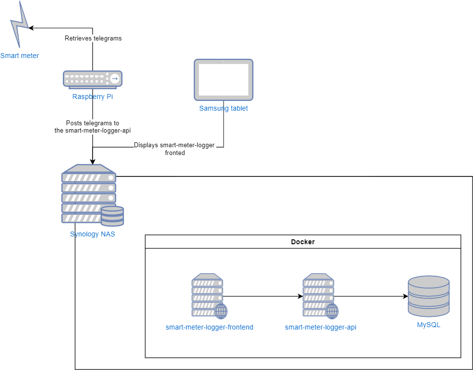

# smart-meter-logger-backend

API for receiving and storing the telegrams from the rpi-smartmeter-logger

## Current setup

The rpi-smart-meter-logger Python application is installed on an Raspberry PI, connected to the smart meter using a P1 cable. Crontab triggers the Python script every 10 minutes, which reads a telegram from the smart meter. This is then formatted and posted to the smart-meter-logger-backend. This then stores the data into a relational database.

This data can then be retrieved by the smart-meter-logger-frontend application and displayed, allowing for insights into the usage of both gas and electricity

## Future

Although this setup works, I want to experiment with MQTT. This also allows for me to use a Home automation System such as Home Assistant or Domoticz to recieve the data in the future.

Therefore I'm planning on the following:

- Setup an MQTT broker on my Synology NAS (using Eclipse Mosquitto)
- Alter the rpi-smart-meter-logger script so that instead of posting the telegrams directly to the smart-meter-logger-backend, the data is posted to the broker (using Paho MQTT)
- Implement a .NET background service that subscribes to the MQTT broker (using MQTTnet) to retrieve the published data and store it in the database
- Alter the smart-meter-logger-backend so that it no longer is used for storing the rpi-smart-meter-logger data

## Other documentation

- [Database manipulation](docs/database-manipulation.md)
- [Deployment with docker](docs/deployment-with-docker.md)
